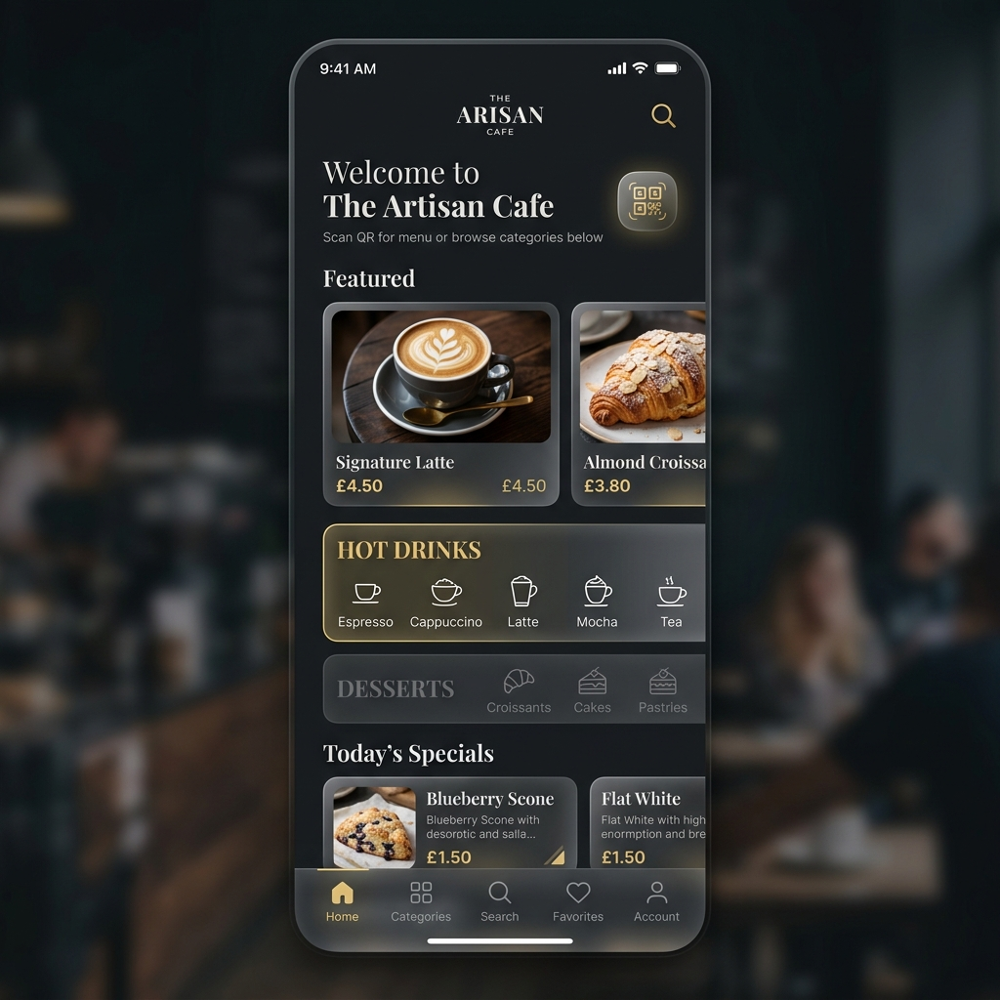
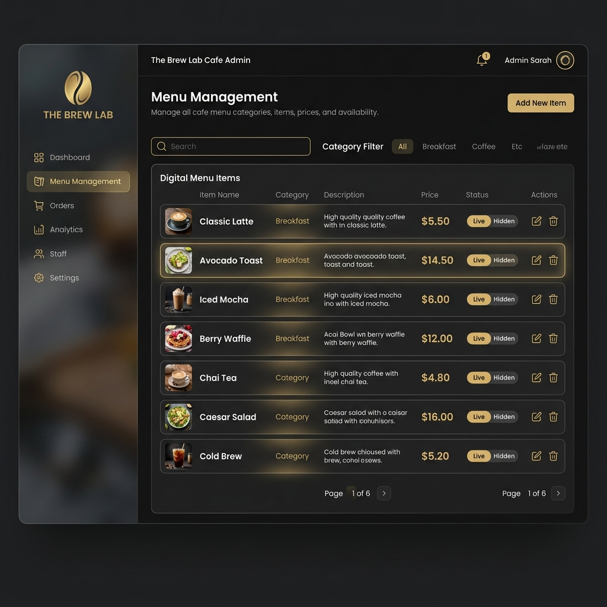

<div align="center">
  <h1>☕ Kafe QR Menü</h1>
  <p>Modern, şık ve hızlı bir dijital QR menü ve yönetim sistemi.</p>
</div>

<br />

## 🌟 Proje Hakkında

**Kafe QR Menü**, kafeler ve restoranlar için geliştirilmiş, masalardaki QR kodlar okutularak erişilebilen dijital bir menü uygulamasıdır. Proje, müşterilerin ürünleri fiyat, görsel ve açıklamalarıyla şık bir tasarımla inceleyebilmesini sağlarken; işletme sahiplerinin de bu ürünleri ve kategorileri kolayca yönetebileceği bir admin paneli sunar.

Modern web teknolojileri kullanılarak geliştirilmiş olup, göz alıcı bir kullanıcı deneyimi ("glassmorphism" tarzı UI, premium renk paleti) ve yüksek performans sunar.

### 📸 Ekran Görüntüleri

<div align="center">
  
  &nbsp; &nbsp; &nbsp;
  
</div>

## ✨ Özellikler

### 📱 Müşteri Arayüzü (QR Menü)
- **Modern ve Şık Tasarım:** Kullanıcı dostu, animasyonlarla desteklenmiş lüks görünüm.
- **Kategorilere Göre Menü:** Ürünleri sıcak içecekler, soğuk içecekler, tatlılar vb. olarak filtreleme.
- **Dil Desteği Genişletilebilirliği:** Her dilde menü içeriğinin sorunsuz görüntülenmesi için özel imaj fallback (görsel desteklemesi) yapıları.
- **Görsel Fallback Sistemi:** Olası görsel yükleme hatalarında veya görseli olmayan ürünlerde şık "Görsel Yok" görünümü.
- **Mobil Odaklı (Mobile-First) Düzen:** Telefon ve tabletlerde mükemmel görünüm.

### ⚙️ Yönetici Paneli (Admin Dashboard)
- **Güvenli Giriş Sistemi:** Supabase Authentication tabanlı admin girişi.
- **Ürün ve Kategori Yönetimi:** Yeni ürün ekleme, düzenleme, fiyat güncelleme ve silme.
- **Görsel Yükleme:** (Supabase Storage entegrasyonuyla) ürün görsellerini hızlıca sisteme dahil etme.

## 🛠️ Kullanılan Teknolojiler

- **Frontend:** [React 19](https://react.dev/) + [TypeScript](https://www.typescriptlang.org/)
- **Derleyici (Build Tool):** [Vite](https://vitejs.dev/)
- **Backend & Veritabanı:** [Supabase](https://supabase.com/) (PostgreSQL & Storage & Auth)
- **Stil & Tasarım:** Özel (Vanilla) CSS, CSS Variables, Glassmorphism Efektleri, Responsive Grid Layout
- **İkonlar:** [Lucide React](https://lucide.dev/)
- **Yönlendirme (Routing):** [React Router v7](https://reactrouter.com/)

## 🚀 Kurulum ve Çalıştırma

Projeyi yerel ortamınızda çalıştırmak için aşağıdaki adımları takip edebilirsiniz:

### 1 Gereksinimler
Sisteminizde [Node.js](https://nodejs.org/) (önerilen v18+) yüklü olmalıdır.

### 2. Projeyi Klonlayın
```bash
git clone <proje-repo-adresi>
cd kafe
```

### 3. Bağımlılıkları Yükleyin
```bash
npm install
```

### 4. Çevresel Değişkenleri Ayarlayın
Proje ana dizininde `.env.local` adlı bir dosya oluşturun ve Supabase bilgilerinizi girin:

```env
VITE_SUPABASE_URL=sizin_supabase_proje_url_adresiniz
VITE_SUPABASE_ANON_KEY=sizin_supabase_anon_key_bilginiz
```

*(Not: Firebase yerine tamamen Supabase altyapısına geçiş yapılmıştır. İhtiyaç halinde `createAdmin.mjs` dosyası veya Supabase Auth üzerinden admin yetkilendirmesi yapılabilir.)*

### 5. Geliştirme Sunucusunu Başlatın
```bash
npm run dev
```
Uygulama genellikle `http://localhost:5173` adresinde çalışmaya başlayacaktır.

## 📦 Derleme (Production Build)

Uygulamayı canlıya almak üzere derlemek için:

```bash
npm run build
```

Ardından, sonucu önizlemek için:

```bash
npm run preview
```

## 📄 Lisans

Bu proje kişisel kullanım ve test amaçlı geliştirilmiştir. Tüm hakları gizlidir veya belirteceğiniz açık kaynak (Örn. MIT) lisansına tabidir.
